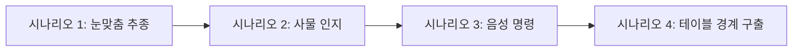

# 🎪 [전시회 설명자 가이드] 반려형 AI 로봇 강아지 '토토(Toto)' 도슨트 매뉴얼

> **"부스 설명자님을 환영합니다!"**  
> 본 가이드는 전시회 현장에서 관람객들에게 로봇 강아지 **'토토(Toto)'**를 가장 흥미롭고 스마트하게 설명하고 시연할 수 있도록 돕는 실전 매뉴얼입니다. 
> 
> 관람객들의 연령과 지식 수준에 맞춘 친절한 설명 비법부터 현장 시연 시나리오, 자주 묻는 질문(FAQ)에 대한 대처법까지 가득 담았습니다. 이 가이드 하나만 정독하시면 전시회 최고의 인기 부스를 이끄는 스타 도슨트가 되실 수 있습니다! 🚀

---

## 💡 1. 핵심 요약 (이 로봇은 무엇인가요?)

**단 한 줄로 설명하기:**  
> **"토토는 클라우드 거대 AI(Gemini Robotics-ER)와 로컬 비전 기술(OpenCV)을 융합하여, 진짜 반려견처럼 사람과 교감하고 행동하는 '디지털 영혼'을 가진 하이브리드 로봇 강아지입니다."**

### 🌟 핵심 키워드 3가지
1. **대뇌 피질 (Cortex - Cloud AI)**: Google의 최신 로보틱스 전용 인공지능인 **'Gemini Robotics-ER 1.6 Preview'**를 탑재하여 사물과 사람을 다차원적으로 이해하고 감정을 생각(Thought)으로 도출합니다.
2. **반사 신경 (Reflex - Local CV)**: 라즈베리 파이와 **OpenCV 얼굴 인식**을 활용해 지연 시간 없이 초당 30프레임으로 사람을 바라보고 정밀하게 거리와 각도를 유지하며 따라옵니다.
3. **지능형 방어선 (Odometry & Safety)**: 낙하 방지 물리 센서가 없는 한계를 수학적 가상 오도메트리(좌표 계산)와 외적(Cross Product) 알고리즘으로 극복하여, 테이블 끝을 스스로 인지하고 중심지로 복귀하는 낙하 방지 안전 시스템을 갖추고 있습니다.

---

## 🎭 2. 관람객 맞춤형 멘트 가이드 (Easy Analogies)

관람객의 특성에 맞게 비유를 활용하면 더욱 설득력 있는 설명이 가능합니다.

### 🧒 어린이 / 일반 관람객 (감성 및 교감 중심)
> *"안녕하세요! 여기 귀여운 로봇 강아지 **'토토'**와 인사해 보세요. 토토는 단순한 장난감이 아니라 머릿속에 **엄청나게 똑똑한 인공지능 뇌(Gemini)**가 들어있어요. 토토 앞에 서시면 토토가 여러분의 얼굴을 알아보고 눈동자를 맞추며 꼬리를 살랑살랑 흔들며 따라온답니다. 저기 모니터 보이시죠? 토토가 지금 여러분을 보면서 무슨 생각을 하고 있는지 실시간 속마음(Thought)이 영어로 올라오고 있어요! 진짜 살아있는 강아지 같지 않나요?"*

### 💻 전공자 / 엔지니어 / IT 마니아 (기술 아키텍처 중심)
> *"본 시스템은 **클라우드 고수준 인지(High-level Cognitive Cortex)**와 **로컬 초고속 제어(Low-level Reflex Control Loop)**를 결합한 **하이브리드 로보틱스 아키텍처**입니다.  
> 고부하 인지 모델인 **Gemini Robotics-ER 1.6 Preview**가 비동기적으로 다중 오브젝트 탐지 및 세만틱 분석을 수행해 영문 Thought을 빌딩하고 짖기/소리내기 이벤트를 발생시키며, 실시간 정렬 및 주행은 라즈베리 파이 4B에서 OpenCV Haar Cascade 얼굴 추적 및 가상 오도메트리 좌표 연산을 통해 30 FPS 수준의 로컬 피드백 루프로 부드럽게 유지합니다."*

---

## 🎬 3. 전시회 현장 실전 시연 시나리오 (Demonstration)

관람객들의 눈길을 사로잡을 수 있는 4가지 실전 쇼케이스 코스입니다.

### 👁️ 시나리오 1. 토토와 눈 맞추기 (OpenCV 추적 시연)
* **액션**: 설명자 혹은 관람객이 토토의 카메라 정면(약 50cm~1m 거리)에 섭니다.
* **보여줄 현상**: 토토가 관람객의 얼굴을 인식하고 고개를 맞춥니다. 설명자가 좌우로 움직이면 토토가 그 방향으로 즉시 회전합니다. 뒤로 슬금슬금 물러나면 토토가 앞으로 쪼르르 따라오고, 너무 가까이 다가가면 흠칫 뒤로 물러납니다.
* **코멘트**: *"토토는 로컬 OpenCV 비전 알고리즘을 사용해 30 FPS 속도로 얼굴의 크기와 중심축을 계산해요. 얼굴이 화면 정중앙에 위치하도록 모터를 실시간 서보 제어하는 정밀한 추적 기술입니다!"*

### 🦴 시나리오 2. "이건 내 장난감이야!" (Gemini 사물 인지 시연)
* **액션**: 준비된 장난감 뼈다귀(`toy bone`)나 사료 그릇(`bowl`)을 토토의 카메라 앞에 보여주고, 대시보드 화면의 속마음 로그를 가리킵니다.
* **보여줄 현상**: 모니터의 토토 속마음(Thought)에 *"I detected my favorite toy bone! I want to play!"*라는 문구가 뜨며, 토토가 물리적으로 기쁜 듯이 기쁘게 짖고 꼬리를 흔드는 특수 동작(Special Motion)을 취합니다. 사료 그릇을 보면 밥을 달라는 듯 삑-삑 애처로운 알림음을 냅니다.
* **코멘트**: *"방금 클라우드 인공지능인 **Gemini Robotics-ER**이 사진 스냅샷을 분석해 장난감의 위치를 2D 좌표로 찾아냈습니다. 이 정보를 바탕으로 토토는 상황에 맞는 똑똑한 감정 동작을 스스로 결정해 냅니다!"*

### 🗣️ 시나리오 3. "말귀를 알아듣는 토토" (음성 제어 시연)
* **액션**: 마이크에 대고 또렷하고 약간 느린 목소리로 말합니다. (한국어 우선 동작)
  - *"안녕"* (또는 *"인사"*)
  - *"이리와"* (또는 *"따라와"*)
  - *"정지"* (또는 *"멈춰"*)
* **보여줄 현상**: 음성을 인식한 토토가 그에 맞는 제어 동작(고개 끄덕이며 인사하기, 앞으로 주행하기, 즉시 정지하기)을 수행합니다.
* **코멘트**: *"토토는 내부 오디오 스레드에서 음성을 항상 대기하고 있어요. 구글 STT(Speech-to-Text) 기술을 통해 자연어를 분석해 동작 신호로 실시간 라우팅합니다!"*

### 📐 시나리오 4. 절벽 앞에서의 탈출 (오도메트리 & Safe Guard 시연)
* **액션**: 테이블 끝이나 특정 경계 부근으로 토토를 전진시킵니다.
* **보여줄 현상**: 토토가 가상의 경계선(예: 1.2m x 0.8m)에 도달하는 순간 딱 정지하더니, 중심 방향이 왼쪽인지 오른쪽인지 계산하여 스스로 우아하게 회전해 안전한 안쪽 영역으로 복귀합니다.
* **코멘트**: *"토토는 추락 방지용 물리 센서가 없지만, 자신이 움직인 바퀴 회전량과 각도를 수학적으로 누적 계산하는 '오도메트리(Odometry)' 기술이 탑재되어 있어요. 경계에 도달하면 가상의 가속도 '외적(Cross Product)' 수학 공식을 계산해 최적의 방향으로 돌아서 안전 구역으로 돌아옵니다!"*

---

## ❓ 4. 관람객 예상 질문 대처법 (FAQ)

**Q. 카메라 영상 처리를 전부 클라우드로 보내서 하나요?**  
* **A (정답)**: 아닙니다! **하이브리드 분산 처리** 방식입니다. 사람 얼굴을 따라 이리저리 부드럽게 움직이는 '얼굴 추적(Reflex)'은 지연 속도가 제로에 가까워야 하므로 라즈베리 파이 로컬 단에서 OpenCV로 고속 처리합니다. 반면, "이 물건이 장난감인지 밥그릇인지" 분석하고 똑똑한 감정 독백을 빌딩하는 '고차원 상황 분석(Cortex)'은 클라우드의 **Gemini Robotics-ER**에 요청하여 비동기식으로 가져옵니다. 덕분에 인터넷이 끊겨도 기본적인 움직임과 안전 모드는 계속 작동합니다.

**Q. 인터넷 연결이 꼭 필요합니까?**  
* **A (정답)**: 고수준 감정 표현과 사물 인식을 위해서는 클라우드 Gemini API 통신을 위한 Wi-Fi가 필요합니다. 하지만 네트워킹 상태가 극도로 좋지 않을 때는 로봇 내부에 탑재된 **AI Simulation Mind 모드**가 자동으로 가동되어 로컬 시뮬레이션 기반으로 귀여운 독백을 계속 출력하도록 이중 안전 설계가 되어 있습니다.

**Q. 모터 제어 신호가 꼬여서 로봇이 오작동하진 않나요?**  
* **A (정답)**: 매우 예리한 질문입니다! 토토는 카메라 캡처, 로컬 추적, 클라우드 두뇌, 음성 인식 등 총 5개의 백그라운드 스레드가 동시에 가동되는 고난도 멀티스레딩 시스템입니다. 모터 핀 제어가 겹치지 않도록 코드 내부에 동기화 락 구조(`_motor_lock`)가 완벽하게 안전망을 형성하고 있어, 여러 스레드에서 동시에 주행 신호를 내려도 버그 없이 안정적으로 동작합니다.

**Q. 갑자기 로봇이 멈추고 대시보드 화면에 'Uncertainty Limit Exceeded'라고 뜨며 삐- 소리가 납니다. 고장인가요?**  
* **A (정답)**: 고장이 아닙니다! 토토의 똑똑한 **Fail-Safe(위험 방지 시스템)**가 작동한 것입니다. 엔코더가 없는 상태로 오랫동안 바퀴를 굴리다 보면 실제 위치와 수학적 가상 위치 사이에 오차가 미세하게 누적되는데, 이 누적 추정 오차(불확실성)가 250mm를 초과하면 낙하 사고를 막기 위해 스스로 모터를 락 상태로 잠그는 스마트한 설계입니다. 이때는 대시보드 화면에서 **'Re-home / Reset Coordinates' 버튼**을 클릭하여 좌표를 초기화해 주시면 다시 쾌활하게 질주합니다.

---

## 🚨 5. 설명자를 위한 초간단 트러블슈팅 (Troubleshooting)

전시회 현장에서 돌발 상황이 발생했을 때 당황하지 않고 30초 만에 대처하는 요령입니다.

1. **토토가 얼굴 추적을 하지 않고 멍하니 서 있을 때:**
   - 관람객 얼굴의 조도가 너무 어둡거나 정면을 바라보지 않았는지 확인해 주세요. 
   - 주변 조명이 너무 밝아 역광이거나 렌즈에 이물질이 묻었다면 닦아주시고, 관람객에게 1m 내외의 거리에서 정면을 응시하도록 가이드해 주세요.
2. **Wi-Fi 통신 지연 혹은 네트워크가 완전 차단되었을 때:**
   - Gemini API 통신이 일시 실패하더라도 토토는 즉시 **'Gemini 2.5 Flash' 모델로 자동 대체(Fallback)**하거나 **Simulation Mind 모드**로 스위칭하여 스스로 가상의 생각을 만들고 OpenCV 추종 및 오도메트리 가상 테이블 탈출을 끊김 없이 진행하므로 안심하고 관람객을 안내하세요.
3. **토토의 움직임이나 좌표가 꼬였을 때 (강제 리셋 비법):**
   - 부스 컴퓨터로 웹 대시보드 주소 `http://localhost:5000` (혹은 라즈베리파이 IP 주소)에 접속합니다.
   - 메인 화면에 위치한 **[Reset Odometry]** 또는 **[Re-home]** 버튼을 가볍게 한 번 클릭해 줍니다. 
   - 토토는 현재 위치를 즉시 안전한 원점(0, 0)으로 보정하고 다시 활기찬 모습으로 복귀합니다.

---

> 💝 **부스 설명자님께 드리는 마지막 응원**  
> 이 로봇은 기술(Hardware & Software)과 예술(Storytelling)의 조화로운 접점에 놓인 놀라운 작품입니다. 설명자님의 미소 띤 친절한 설명과 토토의 재치 있는 몸짓이 만나면 관람객들에게 잊지 못할 최고의 경험을 선물할 것입니다. 힘차게 파이팅입니다! 토토와 함께 즐거운 전시회를 만들어 주세요! 🐾🌟
