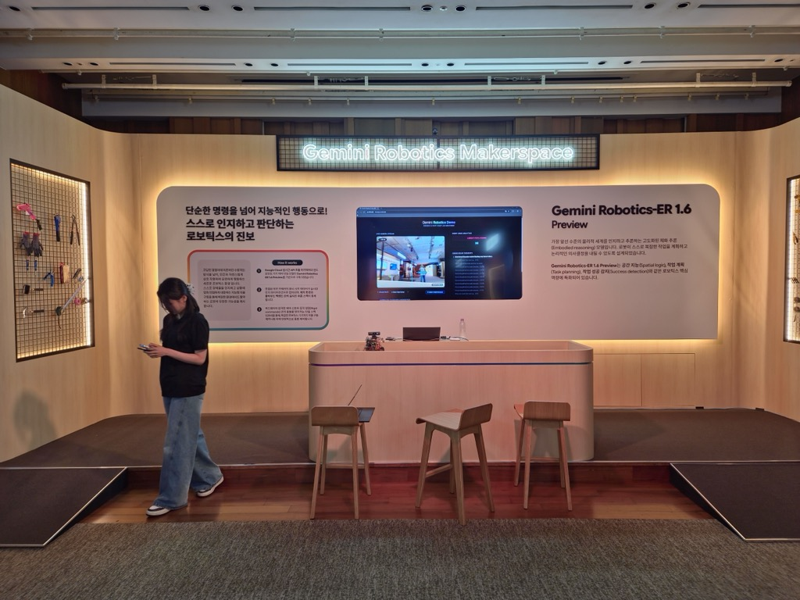
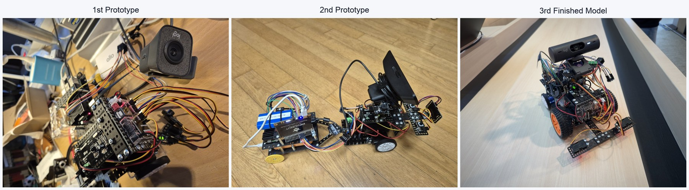
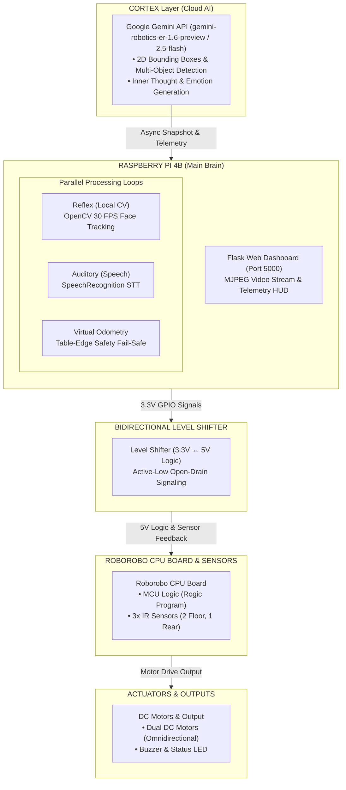
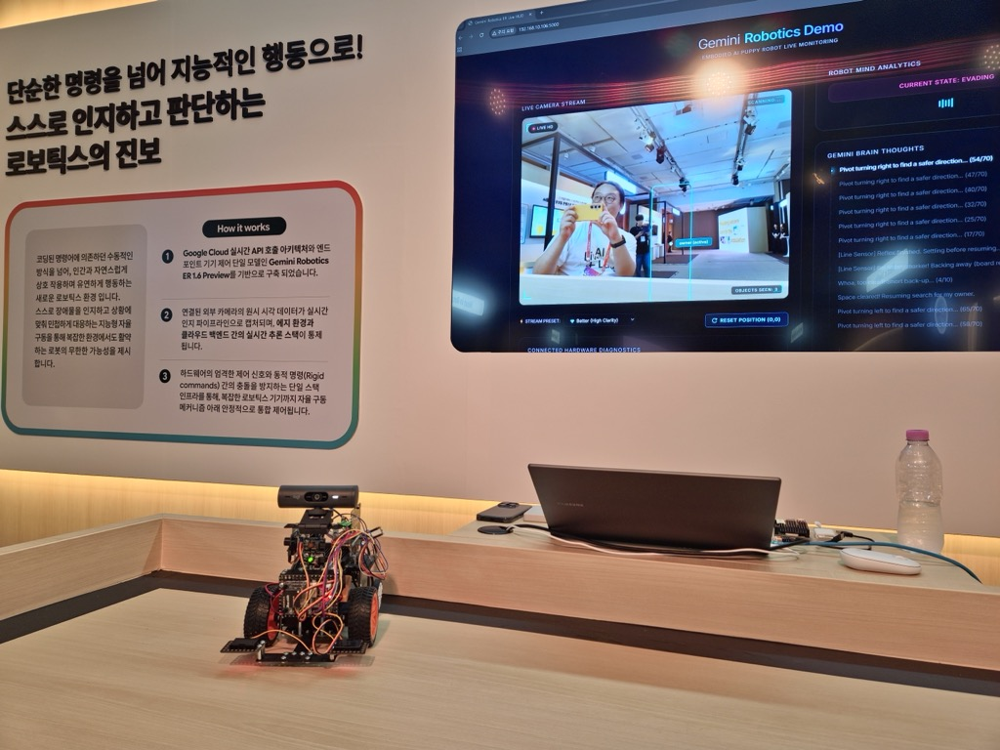
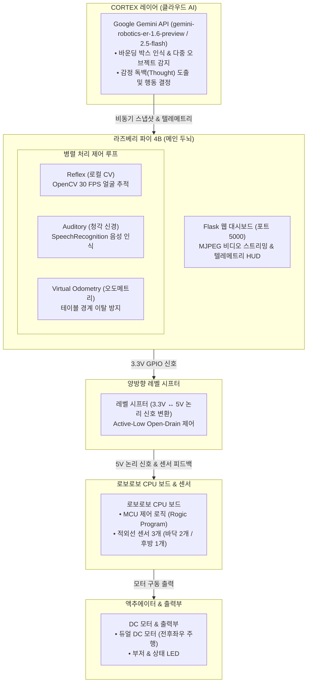

[English](#english) | [한국어](#korean)

<a id="english"></a>

# Gemini Robotics Makerspace: Intelligent AI Robot Puppy

A hybrid robotics architecture combining cloud-based multimodal AI (Cortex) with high-speed local control loops (Reflex) for a companion robot puppy, created for the [Google AI + Live Labs, Gemini Playground (Gemini Robotics Makerspace)](https://cloudonair.withgoogle.com/events/gemini-playground) booth.



---

## Why We Built It (Motivation & Vision)

Created for the [Google AI + Live Labs, Gemini Playground (Gemini Robotics Makerspace)](https://cloudonair.withgoogle.com/events/gemini-playground) exhibition booth, this project powered by [Google Gemini Robotics-ER 1.6 Preview](https://ai.google.dev/gemini-api/docs/models/gemini-robotics-er-1.6-preview) was born out of a clear core philosophy: **to showcase the breakthrough capabilities and superiority of Google's flagship embodied AI model not through abstract text or benchmark papers, but through a physical, living machine interacting in real time.**

By fusing the high-level cloud intelligence of [Gemini Robotics-ER 1.6 Preview](https://ai.google.dev/gemini-api/docs/models/gemini-robotics-er-1.6-preview) (Cortex) with a high-speed local control loop (Reflex), the robot puppy "Toto" gains a true "digital soul":
- **Spatial Object Perception**: Leverages [Gemini Robotics-ER](https://ai.google.dev/gemini-api/docs/models/gemini-robotics-er-1.6-preview)'s spatial intelligence to pinpoint owners, toys, and food bowls in 2D space (`[ymin, xmin, ymax, xmax]` normalized coordinates).
- **Inner Monologue**: Generates real-time emotional thoughts explaining what the robot perceives and how it feels as a living companion.
- **Embodied Expressiveness**: Translates cloud AI reasoning into physical motor actions—barking joyfully for toys, whining/beeping for food, and tracking its owner's face while remaining safely bounded on a table via dead-reckoning odometry.

---

## Operating Mechanism (How It Works)

The robot operates through a **dual-tier hybrid AI architecture**:

1. **Cortex Layer (Cloud Multimodal AI)**:
   - Asynchronously sends camera snapshots to Google Cloud Gemini API (`gemini-robotics-er-1.6-preview` with fallback to `gemini-2.5-flash`).
   - Analyzes semantic context, identifies target objects, and yields inner thoughts and emotional behavioral commands.
2. **Reflex Layer (Local High-Speed Vision)**:
   - Runs OpenCV Haar Cascade face detection at 30 FPS locally on Raspberry Pi 4B (downsampled to 320x240 for CPU optimization).
   - Adjusts motor heading and proportional distance alignment in real-time, unaffected by network latency.
3. **Auditory Layer (Voice Commands)**:
   - Listens to microphone audio via `SpeechRecognition` for bilingual Korean and English commands ("이리와 / Come here", "인사 / Hello", "멈춰 / Stop").
4. **Odometry & Table Safety Layer**:
   - Tracks 2D coordinates `(X, Y, Heading)` on a `1200mm x 800mm` virtual table. Calculates cross-product vectors $\text{cross-product} = X \cdot \sin(\theta) - Y \cdot \cos(\theta)$ to automatically steer back to center when hitting boundary margins.
5. **Hardware MCU Reflex Layer (`./robo-rogic-code/`)**:
   - Roborobo MCU runs Rogic Program logic for floor tape/cliff detection (2 front IR sensors) and rear obstacle avoidance (1 rear IR sensor).

---

## Architecture Overview

The system runs on a **Raspberry Pi 4B** linked to a **Roborobo Educational Robotics CPU Board** via bidirectional level shifters, providing real-time vision, voice interaction, emotional behavioral responses, and web-based telemetry HUD monitoring.

The physical robot is constructed using the [ROBO KIT STEP 1 to 3](https://roboroboshop.com/product/list.html?cate_no=173) platform, driven by two DC motors for omnidirectional movement (forward, backward, left, and right). The MCU logic is flashed using the **Rogic Program** (stored in `./robo-rogic-code/`) and interfaces with three infrared (IR) sensors:
- **2 Front-facing IR Sensors (Floor-directed)**: Continuously monitor the surface beneath the robot. If a black boundary line appears or if the floor disappears (table edge/cliff), the MCU logic immediately stops the robot and steps back.
- **1 Rear-facing IR Sensor (Backward-directed)**: Detects walls or obstacles approaching from behind. When an obstacle gets too close, the MCU logic stops the robot and moves it forward/away from the barrier.





---

## Key Features

1. **Cortex Layer (Cloud Multimodal AI)**
   - Uses [`gemini-robotics-er-1.6-preview`](https://ai.google.dev/gemini-api/docs/models/gemini-robotics-er-1.6-preview) (with automatic fallback to `gemini-2.5-flash`) via the `google-genai` SDK.
   - Detects the owner, toys, food bowls, and objects using 2D normalized bounding boxes.
   - Generates emotional thoughts and triggers contextual behaviors (e.g., barking joyfully for toys, whiping/beeping for food).

2. **Reflex Layer (Local Face Tracking)**
   - High-speed OpenCV Haar Cascade face detection loop running at 30 FPS.
   - Distance-based proportional alignment: adjusts motor heading to keep the target centered and maintains a comfortable distance (moving forward if far, backward if too close).

3. **Auditory Layer (Voice Control & Live API Streaming)**
   - Streams live microphone audio via WebSockets using the **Gemini Live API (`gemini-3.1-flash-live-preview`)** for zero-latency natural language intent matching.
   - Falls back to `SpeechRecognition` / `PyAudio` with `gemini-2.5-flash` if WebSocket streaming is unavailable.
   - Supports bilingual voice commands: `이리와` (come), `멈춰` / `정지` (stop), `돌아` (spin), `앞으로` (forward), `뒤로` (backward), `인사` / `안녕` (greet), `짖어` / `멍멍` (bark).

4. **Odometry & Table Safety System**
   - Software-based dead-reckoning odometry to track virtual coordinates `(X, Y, Heading)`.
   - Fail-safe boundary detection to prevent the robot from falling off a `1200mm x 800mm` table surface.
   - Calculates cross-product directional vectors to steer back into safe bounds automatically.
   - Position uncertainty estimator triggers emergency stop when open-loop drift exceeds safe limits.

5. **Flask Telemetry HUD Dashboard**
   - Live dark-mode web monitoring dashboard served on port `5000`.
   - Real-time MJPEG video stream with bounding box overlays.
   - Interactive 2D table coordinate visualizer, CPU temperature gauge, and manual odometry reset controls.

---

## Detailed Threading & Execution Architecture

The system achieves low latency by distributing tasks across **5 background daemon threads** and **1 main Flask server thread**:

| Thread | Function Name | Role & Responsibilities | Optimization & Synchronization |
| :--- | :--- | :--- | :--- |
| **Thread 0 (Camera)** | `camera_capture_thread` | Captures VGA (640x480) camera frames into memory | Synchronized via `camera_lock` to eliminate I/O bottleneck |
| **Thread 1 (Reflex)** | `vision_control_thread` | Runs OpenCV Haar Cascade face tracking (30 FPS) and distance alignment | Downsampled to 320x240 for low CPU usage; updates Odometry |
| **Thread 2 (Auditory)** | `audio_recognition_thread` | Listens for Korean (`ko-KR`) and English (`en-US`) voice commands | Protected by `is_robot_busy` lock to prevent motor conflict |
| **Thread 3 (Cortex)** | `gemini_brain_thread` | Uploads snapshot to Gemini API for 2D bounding boxes & inner thoughts | Async Cortex processing; fallback to `gemini-2.5-flash` on limit |
| **Thread 4 (Encoder)** | `streaming_encoder_thread` | Encodes RAW frames into JPEG byte streams for HUD dashboard | Decouples video encoding load from real-time control loops |
| **Main Web Server** | `app.run` | Serves MJPEG video feed, telemetry API, and manual odometry resets | Flask micro web server on Port 5000 |

---

## Mathematics of Odometry & Safety Boundaries

1. **Cross-Product Boundary Recovery Formula**:
   When the robot exceeds the virtual table perimeter (`1200mm x 800mm`), it calculates the cross-product vector from its current coordinates `(X, Y)` and heading angle `θ`:
   $$\text{cross-product} = X \cdot \sin(\theta) - Y \cdot \cos(\theta)$$
   - If $\text{cross-product} > 0$: Center origin is to the left -> Execute `turn_left()`
   - If $\text{cross-product} < 0$: Center origin is to the right -> Execute `turn_right()`

2. **Open-Loop Fail-Safe Uncertainty Accumulator**:
   Open-loop odometry accumulates drift over time. The system tracks an estimated position uncertainty value:
   - $+0.04\text{mm}$ error added per $1\text{mm}$ driven (~4% distance error)
   - $+0.25\text{mm}$ error added per $1^\circ$ turned (~15mm error per 60° rotation)
   - When accumulated uncertainty exceeds **$250\text{mm}$**, the robot halts driving and requests operator re-homing for safety.

3. **Hardware Race-Condition Protection**:
   All low-level GPIO pin write operations are serialized using `_motor_lock` (Threading Lock) to prevent motor signal corruption when concurrent threads (e.g. emotion expression vs boundary recovery) execute simultaneously.

4. **Odometry Master Toggles & Configuration Parameters (`robot_controller.py`)**:
   Odometry safety guarding can be easily enabled, disabled, or tuned directly at the top of `robot_controller.py`:
   - **`ODOMETRY_SAFETY_ENABLED` (Boolean, default: `False`)**:
     - `True`: Enforces strict software fail-safe boundary checks. If accumulated position drift exceeds `UNCERTAINTY_LIMIT` ($250\text{mm}$), forward motion is locked until re-homed.
     - `False`: Disables strict software boundary locks, allowing full roaming freedom or relying on hardware IR sensors / cooperative caution mode.
   - **`EDGE_CAUTION_ENABLED` (Boolean, default: `True`)**:
     - `True`: Enables cooperative caution mode with the Roborobo CPU board's black-line reflex. When odometry detects the robot nose within $150\text{mm}$ (`EDGE_CAUTION_BAND`) of the boundary line, forward drive is automatically pulsed to 50% speed (`EDGE_PULSE_DUTY = 0.5`), doubling the sensor response time budget.
   - **Tuning Parameters**:
     - `SPEED_LINEAR = 260.0`: Linear travel speed ($260\text{mm/s}$).
     - `SPEED_ANGULAR = 22.5`: Angular rotation speed ($22.5^\circ\text{/s}$).
     - `TABLE_WIDTH = 1200.0`, `TABLE_DEPTH = 800.0`: Virtual table dimensions in mm.
     - `UNCERTAINTY_LIMIT = 250.0`: Maximum allowed position drift ($250\text{mm}$) before triggering a fail-safe re-home request.
   - **Runtime Reset**:
     Operators can reset coordinates to origin $(0, 0, 90^\circ)$ and zero out uncertainty at runtime via the Flask HUD Dashboard button **`[Reset Odometry]`** (`/api/reset_odometry`).

---

## Live Demonstration Scenarios & Feature Verification

The system includes four primary interactive demonstration scenarios:

1. **Eye-Contact & Proportional Face Tracking (Reflex)**:
   - Stand in front of the camera (0.5m - 1.5m). The robot detects face coordinates at 30 FPS and rotates motors to keep the target centered. It moves forward if the user steps back, and retreats if the user gets too close.
2. **Object Recognition & Emotional Reactions (Cortex)**:
   - Show a toy bone or food bowl to the camera. The Gemini Cortex detects the object bounding box `[ymin, xmin, ymax, xmax]`, builds an inner thought, and triggers contextual emotions (barking joyfully for toys, whining/beeping for food).
3. **Bilingual Voice Commands (Auditory)**:
   - Speak natural language commands into the microphone ("이리와 / Come here", "인사 / Hello", "멈춰 / Stop"). The auditory thread translates audio to STT and executes motion triggers.
4. **Table-Edge Escape & Fail-Safe (Odometry)**:
   - Drive the robot toward the table edge. When virtual coordinates hit boundary limits (`1200mm x 800mm`), the robot stops and uses vector cross-product math $\text{cross-product} = X \cdot \sin(\theta) - Y \cdot \cos(\theta)$ to automatically steer back toward safety.

---

## Frequently Asked Questions (FAQ)

- **Q: Is camera processing purely cloud-based?**
  - **A**: No, it uses a **hybrid architecture**. Real-time 30 FPS face alignment is handled locally on the Raspberry Pi via OpenCV. High-level semantic object recognition and inner thought generation are processed asynchronously via Google Cloud Gemini API.
- **Q: What happens if network latency increases or Wi-Fi drops?**
  - **A**: If the primary `gemini-robotics-er-1.6-preview` API request fails, the system automatically falls back to `gemini-2.5-flash` or local Simulation Mind mode, while local OpenCV tracking and odometry safety loops continue running uninterrupted.
- **Q: How does the system handle 'Uncertainty Limit Exceeded'?**
  - **A**: Open-loop odometry accumulates drift over time. When estimated position uncertainty exceeds $250\text{mm}$, the fail-safe locks motor operations to prevent accidental falls. Simply click the **`[Reset Odometry]` / `[Re-home]`** button on the Flask HUD dashboard to reset coordinates.

---

## Advanced Feature: Pydantic Structured Outputs Migration

To ensure zero JSON parsing failures, Gemini API calls can be enforced via Pydantic schemas using the `google-genai==2.10.0` SDK:

```python
from pydantic import BaseModel, Field
from typing import List, Optional

class DetectedObject(BaseModel):
    box_2d: List[int] = Field(..., description="[ymin, xmin, ymax, xmax] normalized 0-1000 integer scale.")
    label: str = Field(..., description="Object label (e.g. 'toy bone', 'food bowl').")

class PuppyBrainResponse(BaseModel):
    owner_box: Optional[List[int]] = Field(None, description="[ymin, xmin, ymax, xmax] of owner.")
    detected_objects: List[DetectedObject] = Field(default_factory=list)
    thought: str = Field(..., description="Inner thought explaining what you see and feel.")

# API Integration with response_schema
config = types.GenerateContentConfig(
    response_mime_type="application/json",
    response_schema=PuppyBrainResponse,
    temperature=0.3
)
```

---

## Directory Structure

```text
gemini-robotics-makerspace/
├── robot_puppy_core.py               # Main brain controller & Flask HUD web server
├── robot_controller.py               # Low-level GPIO motor control & odometry engine
├── check_env.py                      # Diagnostic tool for environment & Gemini API
├── start.sh                          # Startup script (venv activation & elevated launch)
├── stop.sh                           # Emergency stop script (halts all DC motors)
├── requirements.txt                  # Python dependencies
├── .env.example                      # Environment variables template
├── LICENSE                           # Open source MIT license
├── media/                            # Exhibition scene photos & 1024px compressed assets
│   ├── scene-1.jpg
│   ├── scene-2.jpg
│   └── ...
├── robo-rogic-code/                 # Rogic Program MCU code (.rpj) for Roborobo kit
│   └── robo-raspi-ifelse-avoid-black-line.rpj
└── docs/                             # Hardware & OS documentation (English & Korean)
    ├── battery-capacity-plan.txt
    ├── battery-capacity-plan-ko.txt
    ├── camera-n-battery.txt
    ├── camera-n-battery-ko.txt
    ├── overlay-filesystem.txt
    └── overlay-filesystem-ko.txt
```

---

## Hardware Setup & Pin Mapping

The Raspberry Pi (3.3V logic) communicates with the Roborobo CPU Board (5V logic) through a bidirectional level shifter using **Active-Low Open-Drain** signaling.

| Raspberry Pi Pin (BCM) | Direction | Function | Level Shifter | Roborobo CPU Input/Output |
| :--- | :--- | :--- | :--- | :--- |
| **GPIO 17** | Output | Forward (IN1) | Channel 1 | Motor Forward Input |
| **GPIO 27** | Output | Turn Left (IN2) | Channel 2 | Motor Left Input |
| **GPIO 22** | Output | Turn Right (IN3) | Channel 3 | Motor Right Input |
| **GPIO 23** | Output | Backward (IN4) | Channel 4 | Motor Backward Input |
| **GPIO 24** | Input | Line Signal (`PIN_LINE_SIGNAL`) | Channel 5 | Roborobo IR Reflex Feedback |
| **GND** | - | Common Ground | GND | GND |
| **5V / 3.3V** | Power | Power Rail Reference | HV / LV | VCC |

---

## Prerequisites & Installation

1. **Hardware & System Prerequisites**:
   - Raspberry Pi 4B (2GB+ RAM recommended), USB Webcam, USB Microphone, Roborobo CPU Board with DC motors, Bidirectional Level Shifter.
   - Raspberry Pi OS (Debian 12 Bookworm / 11 Bullseye), Python 3.10 or higher.

2. **Clone and Install Dependencies**:
   ```bash
   git clone https://github.com/your-username/gemini-robotics-makerspace.git
   cd gemini-robotics-makerspace

   python3 -m venv venv
   source venv/bin/activate
   pip install -r requirements.txt
   ```

3. **API Key Configuration**:
   ```bash
   cp .env.example .env
   ```
   Edit `.env` to include your Gemini API key:
   ```env
   GEMINI_API_KEY=AIzaSyYourActualGeminiApiKeyHere
   ```

4. **Hardware & Environment Verification**:
   ```bash
   python3 check_env.py
   ```

5. **Running the Main Robot System**:
   You can launch the robot using `start.sh` or direct python invocation:
   ```bash
   chmod +x start.sh stop.sh
   ./start.sh
   # Or directly:
   python3 robot_puppy_core.py
   ```
   Access HUD Dashboard at: `http://<raspberry-pi-ip>:5000`

6. **Emergency Stop**:
   To immediately halt all motor driving threads, run:
   ```bash
   ./stop.sh
   ```

---

## Technical Documentation

- **[docs/](docs/)**: Operational guides covering Raspberry Pi overlay filesystems, battery power management, camera optimization, and automatic fail-safe recovery.

---

## License

This project is released under the [MIT License](LICENSE).



<div style="page-break-before: always;"></div>

---

[English](#english) | [한국어](#korean)

<a id="korean"></a>

# Gemini Robotics Makerspace: 지능형 AI 로봇 강아지

Google Cloud Gemini API와 라즈베리 파이 4B, 그리고 로보로보 교육용 키트 CPU 보드를 결합하여 구현한 지능형 로봇 강아지(Robotic Puppy) 코어 시스템입니다. [Google AI + Live Labs, Gemini Playground (Gemini Robotics Makerspace)](https://cloudonair.withgoogle.com/events/gemini-playground) 부스 실제 시연용으로 제작되었습니다.


---

## 왜 만들었는가? (프로젝트 기획 및 비전)

기존의 일반적인 교육용이나 장난감 로봇은 센서 입력을 받아 모터를 굴리는 "단순 기계적 반사"만 수행할 뿐, 주변 환경의 맥락을 이해하고 사물을 구별하며 내면의 감정을 나누는 인지 능력을 갖추지 못했습니다.

본 프로젝트는 [Google AI + Live Labs, Gemini Playground (Gemini Robotics Makerspace)](https://cloudonair.withgoogle.com/events/gemini-playground) 부스 시연용으로 기획되었으며, [Google Gemini Robotics-ER 1.6 Preview](https://ai.google.dev/gemini-api/docs/models/gemini-robotics-er-1.6-preview) 모델을 탑재했습니다. 핵심 기획 의도는 "Google Gemini 최첨단 로보틱스 AI의 뛰어난 성능과 가능성을 단순한 말과 글, 텍스트 논문이 아닌 현실 세계에서 물리적으로 동작하는 실제 기계로 생생하게 증명하는 것"이었습니다.

차가운 회로 기판에 [Gemini Robotics-ER 1.6 Preview](https://ai.google.dev/gemini-api/docs/models/gemini-robotics-er-1.6-preview)가 제공하는 "디지털 영혼과 인공 생명력"을 불어넣어 거대 클라우드 AI(Cortex)와 로컬 초고속 제어 루프(Reflex)를 조화롭게 결합했습니다:
- **공간 사물 정밀 인지**: [Gemini Robotics-ER](https://ai.google.dev/gemini-api/docs/models/gemini-robotics-er-1.6-preview) 모델의 정밀한 2D 공간 인지 능력을 활용해 시야 속 주인과 장난감, 밥그릇 등 주요 사물을 정밀하게 감지하고,
- **내면의 생각(Thought) 생성**: 자신이 무엇을 보고 무엇을 느끼는지 인공지능의 내면 독백을 실시간 텍스트로 도출하며,
- **체화된 지능형 행동**: 클라우드 AI 추론 결과를 실제 물리 모터 동작으로 연결하여, 장난감을 보면 기쁘게 짖고, 밥그릇을 보면 애교 소리를 내며, 테이블 낙하 위험 없이 주인을 안전하게 따라다니는 반려형 지능을 완벽히 구현했습니다.

---

## 어떤 방식으로 동작하는가? (운영 및 제어 메커니즘)

로봇은 고수준 인공지능과 저수준 하드웨어 제어가 유기적으로 협응하는 **이중 하이브리드 아키텍처**로 동작합니다:

1. **Cortex 레이어 (클라우드 대뇌 피질)**:
   - 카메라 프레임 스냅샷을 클라우드 Gemini API (`gemini-robotics-er-1.6-preview` 및 `gemini-2.5-flash`)에 비동기 송출합니다.
   - 의미론적 맥락 분석, 다중 오브젝트 인식, 감정 독백 생성 및 정서적 행동 지시를 하달합니다.
2. **Reflex 레이어 (로컬 고속 반사 신경)**:
   - 라즈베리 파이 4B 로컬 단에서 OpenCV Haar Cascade 얼굴 추적을 30 FPS 속도로 실행합니다 (CPU 부하 감소를 위해 320x240 해상도 연산).
   - 클라우드 네트워크 지연 시간과 무관하게 주인의 위치와 거리를 실시간으로 맞추며 추종합니다.
3. **Auditory 레이어 (청각 신경)**:
   - `SpeechRecognition`을 통해 마이크 음성을 수신하여 한국어 및 영어 음성 명령("이리와", "인사", "멈춰", "Come here", "Hello", "Stop")을 감지하고 동작시킵니다.
4. **오도메트리 & 테이블 안전 레이어**:
   - `1200mm x 800mm` 가상 테이블 위에서 2D 좌표 `(X, Y, Heading)`를 실시간 연산하고, 경계 접근 시 외적(Cross Product) 수식 $\text{cross-product} = X \cdot \sin(\theta) - Y \cdot \cos(\theta)$을 연산하여 중앙 원점으로 자동 복귀합니다.
5. **하드웨어 MCU 반사 레이어 (`./robo-rogic-code/`)**:
   - 로보로보 CPU 보드의 Rogic 코드가 전면 적외선 센서 2개(바닥 띠 및 낭떠러지 감지)와 후면 적외선 센서 1개(후방 벽/장애물 접근 감지)를 하드웨어 수준에서 직접 제어하여 물러서도록 가동합니다.

---

## 아키텍처 개요

시스템은 **라즈베리 파이 4B**를 두뇌로 삼아 양방향 레벨 시프터를 통해 **로보로보 CPU 보드**와 인터페이싱하며, 실시간 비전, 음성 인식, 감정 반응 동작, 그리고 웹 기반 텔레메트리 HUD 모니터링을 동시에 수행합니다.

현실 세계에서 동작하는 로봇은 [ROBO KIT STEP 1 to 3](https://roboroboshop.com/product/list.html?cate_no=173)을 활용해서 만들었으며, 2개의 DC 모터를 구동하여 전후좌우로 자유롭게 이동합니다. 로보로보 CPU 마이크로컨트롤러에는 전용 'Rogic Program'으로 작성된 코드(`./robo-rogic-code/`)가 구동되며, 3개의 적외선(IR) 센서를 통해 하드웨어 반사 동작을 수행합니다:
- **전면 적외선 센서 2개 (바닥 방향)**: 바닥면을 지속적으로 감시하여 검은색 띠가 나타나거나 바닥이 사라지는 경계(낙하 위험)를 감지하면 로봇이 즉시 멈추고 물러서도록 동작합니다.
- **후면 적외선 센서 1개 (후방 방향)**: 뒷면을 바라보는 적외선 센서가 벽이나 장애물이 가까워지는 것을 감지하면 로봇이 멈추고 안전거리를 확보하도록 물러서게 설정되어 있습니다.




---

## 주요 기능

1. **Cortex 레이어 (클라우드 인공지능)**
   - `google-genai` SDK를 통해 [`gemini-robotics-er-1.6-preview`](https://ai.google.dev/gemini-api/docs/models/gemini-robotics-er-1.6-preview) 모델을 가동하고 예외 발생 시 `gemini-2.5-flash`로 자동 대체(Fallback)됩니다.
   - 카메라 프레임에서 주인(Owner), 장난감, 밥그릇 등 주요 사물을 2D Bounding Box 단위로 감지합니다.
   - 로봇의 감정을 독백 형태의 Thought으로 생성하며, 장난감 감지 시 짖고 꼬리를 치거나 밥그릇 감지 시 소리를 내는 등 상호작용합니다.

2. **Reflex 레이어 (로컬 얼굴 추적)**
   - 30 FPS 주기의 OpenCV Haar Cascade 기반 로컬 얼굴 감지 및 정렬 루프.
   - 감지된 대상과의 거리에 따라 전진, 후진, 좌/우 회전 제어를 수행하여 주인을 화면 중앙에 고정하고 적정 거리를 유지합니다.

3. **Auditory 레이어 (음성 제어 & Gemini Live API 스트리밍)**
   - **Gemini Live API (`gemini-3.1-flash-live-preview`)**를 활용해 마이크 실시간 오디오를 WebSockets 스트리밍하여 인텐트(Intent)를 매칭합니다.
   - 네트워크 라이브 세션 불가 시 `SpeechRecognition` / `PyAudio` 및 `gemini-2.5-flash`로 자동 대체(Fallback)합니다.
   - 다국어 및 한국어 음성 명령 지원: `이리와` (come), `멈춰` / `정지` (stop), `돌아` (spin), `앞으로` (forward), `뒤로` (backward), `인사` / `안녕` (greet), `짖어` / `멍멍` (bark).

4. **오도메트리 & 테이블 안전 시스템**
   - 센서가 라즈베리 파이에 직접 연결되지 않은 환경을 극복하기 위해 소프트웨어 기반 가상 좌표 추적 `(X, Y, Heading)`을 가동합니다.
   - `1200mm x 800mm` 테이블 경계 이탈 방지(Fail-Safe) 로직을 갖추어 경계 감지 시 외적(Cross Product)을 계산해 안전 구역으로 자동 복귀합니다.
   - 이동량/회전량 누적에 따른 불확실성이 한계를 초과하면 로봇을 정지시키고 Re-home을 요청합니다.

5. **Flask 텔레메트리 HUD 대시보드**
   - 포트 `5000`에서 가동되는 다크 모드 실시간 대시보드.
   - Bounding Box 오버레이가 적용된 MJPEG 비디오 스트리밍.
   - 인터랙티브 2D 테이블 맵, CPU 온도 게이지, 오도메트리 리셋 기능을 제공합니다.

---

## 상세 스레딩 및 실행 아키텍처

병목 현상을 방지하고 반응 속도를 최적화하기 위해 **5개의 백그라운드 데몬 스레드**와 **1개의 메인 Flask 서버 스레드**로 역할을 분담합니다:

| 스레드명 | 타깃 함수 | 역할 및 주요 기능 | 최적화 및 동기화 |
| :--- | :--- | :--- | :--- |
| **Thread 0 (카메라)** | `camera_capture_thread` | USB 카메라(640x480 VGA) 프레임을 지속 수신하여 캐싱 | `camera_lock`으로 동기화하여 I/O 병목 차단 |
| **Thread 1 (Reflex)** | `vision_control_thread` | 30 FPS 주기의 OpenCV Haar Cascade 얼굴 추적 및 거리 정렬 | 320x240 절반 축소 연산으로 CPU 점유율 대폭 절감, 오도메트리 연산 |
| **Thread 2 (Auditory)** | `audio_recognition_thread` | 한국어(`ko-KR`) 및 영어(`en-US`) 음성 명령 인식 | `is_robot_busy` 락으로 모터 제어 충돌 차단 |
| **Thread 3 (Cortex)** | `gemini_brain_thread` | Gemini API에 스냅샷을 비동기 업로드하여 감정 및 객체 인식 | API 오류 시 `gemini-2.5-flash`로 자동 대체(Fallback) |
| **Thread 4 (인코더)** | `streaming_encoder_thread` | RAW 프레임을 대시보드 송출용 JPEG 스트림으로 압축 캐싱 | 비디오 인코딩 부하와 제어 루프를 완전히 분리 |
| **Main Web Server** | `app.run` | MJPEG 비디오 송출, 텔레메트리 API, 오도메트리 리셋 가동 | 포트 5000 Flask 마이크로 웹서버 |

---

## 오도메트리 및 안전 경계 연산 수식

1. **외적(Cross-Product) 경계 복귀 수식**:
   로봇이 테이블 가상 경계(`1200mm x 800mm`)를 이탈하면, 현재 좌표 `(X, Y)`와 진행 각도 `θ`를 기반으로 원점 방향 외적을 계산합니다:
   $$\text{cross-product} = X \cdot \sin(\theta) - Y \cdot \cos(\theta)$$
   - $\text{cross-product} > 0$ 인 경우: 원점이 로봇 기준 좌측에 위치 -> 좌회전(`turn_left`) 실행
   - $\text{cross-product} < 0$ 인 경우: 원점이 로봇 기준 우측에 위치 -> 우회전(`turn_right`) 실행

2. **오픈루프 위치 불확실성 누적기 (Fail-Safe)**:
   엔코더가 없는 오픈루프 주행 오차 누적에 대비하여 불확실성 연산치를 지속 누적합니다:
   - 주행 $1\text{mm}$ 당 $+0.04\text{mm}$ 오차 누적 (이동 거리의 약 4%)
   - 회전 $1^\circ$ 당 $+0.25\text{mm}$ 오차 누적 (60° 회전 시 약 15mm 오차)
   - 누적 불확실성이 $250\text{mm}$를 초과하면 로봇 주행을 정지하고 원점 재배치(Re-home)를 요청합니다.

3. **하드웨어 레이스 조건 방지 (`_motor_lock`)**:
   감정 표현 스레드와 오도메트리 경계 복귀 스레드가 물리 GPIO 핀에 동시에 접근할 때 발생하는 구동 신호 꼬임을 방지하기 위해 로우레벨 GPIO 쓰기 구문 전체를 `_motor_lock` (Threading Lock)으로 직렬화했습니다.

4. **오도메트리 스위치 온/오프 및 옵션 설정 방법 (`robot_controller.py`)**:
   오도메트리 가드 모드는 `robot_controller.py` 상단 스위치 변수 및 파라미터를 수정하여 자유롭게 켜거나 끄고 조정할 수 있습니다:
   - **`ODOMETRY_SAFETY_ENABLED` (Boolean, 기본값: `False`)**:
     - `True`: 엄격한 소프트웨어 안전 경계 및 오차 한계 차단 활성화. 위치 불확실성이 `UNCERTAINTY_LIMIT` ($250\text{mm}$)를 초과하면 정지 및 Re-home 요구.
     - `False`: 소프트웨어 한계 차단을 해제하여 주행 제약을 풀고 로보로보 하드웨어 적외선 센서 및 협응 주의 모드에 의존.
   - **`EDGE_CAUTION_ENABLED` (Boolean, 기본값: `True`)**:
     - `True`: 로보로보 CPU 보드의 검은색 띠 반사 로직과 협응하는 센서 주의 모드. 오도메트리상 센서 위치가 경계선 $150\text{mm}$(`EDGE_CAUTION_BAND`) 이내에 접근하면 전진 속도를 50% 주행 비율(`EDGE_PULSE_DUTY = 0.5`)로 감속 제어하여 적외선 센서 반응 시간을 2배 확보합니다.
   - **주요 튜닝 파라미터**:
     - `SPEED_LINEAR = 260.0`: 직선 주행 속도 ($260\text{mm/s}$).
     - `SPEED_ANGULAR = 22.5`: 회전 제어 속도 ($22.5^\circ\text{/s}$).
     - `TABLE_WIDTH = 1200.0`, `TABLE_DEPTH = 800.0`: 가상 테이블 규격 ($1200\text{mm} \times 800\text{mm}$).
     - `UNCERTAINTY_LIMIT = 250.0`: Fail-Safe가 발동되는 최대 누적 오차 한계치 ($250\text{mm}$).
   - **실시간 리셋 가동**:
     실행 중 언제든지 웹 HUD 대시보드의 **`[Reset Odometry]`** 버튼 (`/api/reset_odometry`)을 클릭하면 현재 위치가 원점 $(0, 0, 90^\circ)$으로 즉시 재설정되고 누적 오차가 초기화됩니다.

---

## 현장 실전 시연 시나리오 및 기능 검증

시스템에는 4가지 핵심 인터랙티브 시연 시나리오가 내장되어 있습니다:

1. **눈맞춤 및 거리 추종 시연 (Reflex)**:
   - 관람객이 카메라 정면(0.5m~1.5m)에 서면 30 FPS 속도로 얼굴 축을 계산하여 중앙을 유지합니다. 멀어지면 전진하고, 너무 가까워지면 뒤로 물러납니다.
2. **사물 인지 및 감정 반응 시연 (Cortex)**:
   - 장난감 뼈다귀나 사료 그릇을 카메라에 보여주면 Gemini Cortex가 2D 바운딩 박스로 인식하여 독백(Thought)을 출력하고 기쁘게 짖거나 애교 소리를 내는 특수 동작을 수행합니다.
3. **양방향 음성 제어 시연 (Auditory)**:
   - 마이크에 대고 자연어 명령("이리와", "인사", "멈춰", "Come here", "Hello", "Stop")을 말하면 구글 STT 분석을 거쳐 로봇이 해당 동작을 가동합니다.
4. **테이블 경계 구출 및 안전 제어 (Odometry)**:
   - 로봇을 테이블 모서리 방향으로 이동시키면 가상 경계(`1200mm x 800mm`) 접근 시 멈춰 서서 외적 수식 $\text{cross-product} = X \cdot \sin(\theta) - Y \cdot \cos(\theta)$을 연산해 중앙 안쪽으로 우아하게 회전해 복귀합니다.

---

## 자주 묻는 질문 (FAQ)

- **Q: 비전 처리를 전부 클라우드로 보내서 하나요?**
  - **A**: 아닙니다! **하이브리드 분산 처리** 방식입니다. 지연 시간이 없어야 하는 얼굴 추종(Reflex)은 라즈베리 파이 로컬에서 OpenCV로 30 FPS 고속 처리하며, 사물 분류 및 감정 독백 생성(Cortex)은 클라우드 Gemini API로 비동기 수신합니다.
- **Q: 인터넷 연결이 끊기거나 지연되면 어떻게 되나요?**
  - **A**: `gemini-robotics-er-1.6-preview` 통신 실패 시 `gemini-2.5-flash` 모델로 자동 대체(Fallback)되거나 로컬 Simulation Mind 모드로 전환되어 기본 움직임과 안전 모드가 끊김 없이 가동됩니다.
- **Q: 대시보드에 'Uncertainty Limit Exceeded' 경고가 뜨고 멈추면 어떻게 하나요?**
  - **A**: 고장이 아닙니다! 오픈루프 주행 누적 오차가 250mm를 초과했을 때 낙하를 막는 **Fail-Safe 안전 장치**입니다. 대시보드 화면에서 **`[Reset Odometry]` / `[Re-home]`** 버튼을 클릭하면 좌표가 원점으로 보정되어 정상 복귀합니다.

---

## 고급 기능: Pydantic Structured Outputs 전환 가이드

Gemini API 응답의 파싱 에러율을 0.0%로 수렴시키기 위해 `google-genai==2.10.0` SDK의 `response_schema` 옵션을 활용하여 Pydantic 모델을 정의할 수 있습니다:

```python
from pydantic import BaseModel, Field
from typing import List, Optional

class DetectedObject(BaseModel):
    box_2d: List[int] = Field(..., description="[ymin, xmin, ymax, xmax] 정수 스케일 좌표")
    label: str = Field(..., description="사물 명칭 (예: 'toy bone', 'food bowl')")

class PuppyBrainResponse(BaseModel):
    owner_box: Optional[List[int]] = Field(None, description="주인 바운딩 박스 좌표")
    detected_objects: List[DetectedObject] = Field(default_factory=list)
    thought: str = Field(..., description="로봇의 내면 생각 독백")

# API 호출 설정
config = types.GenerateContentConfig(
    response_mime_type="application/json",
    response_schema=PuppyBrainResponse,
    temperature=0.3
)
```

---

## 디렉토리 구조

```text
gemini-robotics-makerspace/
├── robot_puppy_core.py               # 메인 두뇌 제어기 & Flask HUD 웹 서버
├── robot_controller.py               # 로컬 GPIO 모터 제어 & 오도메트리 엔진
├── check_env.py                      # 환경 및 Gemini API 통신 진단 도구
├── start.sh                          # 가동 스크립트 (가상환경 활성화 및 권한 승격 실행)
├── stop.sh                           # 긴급 정지 스크립트 (모든 DC 모터 정지)
├── requirements.txt                  # 파이썬 의존성 패키지 명세
├── .env.example                      # 환경변수 템플릿
├── LICENSE                           # MIT 오픈소스 라이선스
├── media/                            # 부스 시연 사진 및 1024px 압축 리소스
│   ├── scene-1.jpg
│   ├── scene-2.jpg
│   └── ...
├── robo-rogic-code/                 # 로보로보 CPU 마이크로컨트롤러용 Rogic 코드 (.rpj)
│   └── robo-raspi-ifelse-avoid-black-line.rpj
└── docs/                             # 카메라, 배터리, 오버레이 파일시스템 문서 (영문 & 한국어 번역)
    ├── battery-capacity-plan.txt
    ├── battery-capacity-plan-ko.txt
    ├── camera-n-battery.txt
    ├── camera-n-battery-ko.txt
    ├── overlay-filesystem.txt
    └── overlay-filesystem-ko.txt
```

---

## 하드웨어 결선 및 핀 맵

라즈베리 파이(3.3V 논리레벨)와 로보로보 CPU 보드(5V 논리레벨)는 양방향 레벨 시프터를 거쳐 **Active-Low Open-Drain** 신호로 연결됩니다.

| 라즈베리 파이 핀 (BCM) | 입출력 방향 | 기능 | 레벨 시프터 | 로보로보 CPU 입력/출력 |
| :--- | :--- | :--- | :--- | :--- |
| **GPIO 17** | Output | 전진 (IN1) | 채널 1 | 모터 전진 입력 |
| **GPIO 27** | Output | 좌회전 (IN2) | 채널 2 | 모터 좌회전 입력 |
| **GPIO 22** | Output | 우회전 (IN3) | 채널 3 | 모터 우회전 입력 |
| **GPIO 23** | Output | 후진 (IN4) | 채널 4 | 모터 후진 입력 |
| **GPIO 24** | Input | 라인 신호 (`PIN_LINE_SIGNAL`) | 채널 5 | 로보로보 적외선 반사 신호 수신 |
| **GND** | - | 공통 접지 | GND | GND |
| **5V / 3.3V** | Power | 전원 레일 | HV / LV | VCC |

---

## 사전 요구 사항 및 설치 방법

1. **사전 요구 사항**:
   - 라즈베리 파이 4B (2GB RAM 이상 권장), USB 웹캠, USB 마이크, DC 모터가 포함된 로보로보 CPU 보드, 양방향 레벨 시프터.
   - Raspberry Pi OS (Debian 12 Bookworm / 11 Bullseye), Python 3.10 이상.

2. **저장소 클론 및 패키지 설치**:
   ```bash
   git clone https://github.com/your-username/gemini-robotics-makerspace.git
   cd gemini-robotics-makerspace

   python3 -m venv venv
   source venv/bin/activate
   pip install -r requirements.txt
   ```

3. **API 키 설정**:
   ```bash
   cp .env.example .env
   ```
   `.env` 파일에 발급받은 Gemini API 키를 입력합니다:
   ```env
   GEMINI_API_KEY=본인의_gemini_api_key_입력
   ```

4. **환경 및 하드웨어 검증**:
   ```bash
   python3 check_env.py
   ```

5. **메인 로봇 시스템 가동**:
   `start.sh` 스크립트를 사용하거나 직접 파이썬으로 가동합니다:
   ```bash
   chmod +x start.sh stop.sh
   ./start.sh
   # 또는 직접 실행:
   python3 robot_puppy_core.py
   ```
   동일 네트워크상의 브라우저에서 HUD 대시보드에 접속합니다: `http://<라즈베리파이-IP>:5000`

6. **긴급 모터 정지**:
   주행 중 모터를 즉시 강제 정지시키려면 다음 명령을 실행합니다:
   ```bash
   ./stop.sh
   ```

---

## 기술 문서 안내

- **[docs/](docs/)**: 라즈베리 파이 오버레이 파일시스템, 전원 관리 및 카메라 관련 기술 문서.

---

## 라이선스

본 프로젝트는 [MIT License](LICENSE)에 따라 자유롭게 이용 및 수정이 가능합니다.


