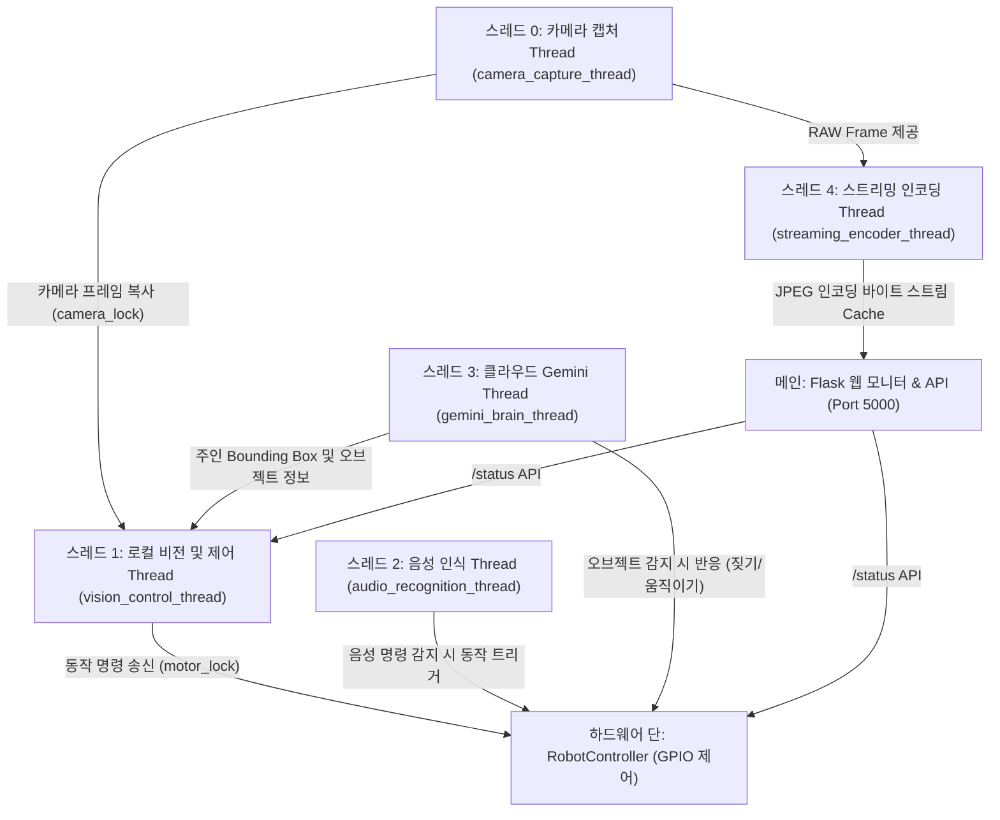

# Gemini Robotics AI Robot Puppy 프로젝트 분석 보고서

본 보고서는 **Gemini Robotics-ER 1.6 Preview** 모델과 **Raspberry Pi 4B**, 그리고 **Roborobo 교육용 키트 CPU 보드**를 결합하여 구현한 **지능형 반려형 로봇 강아지(Robotic Puppy) 코어 시스템**에 대한 구조 및 동작 분석 결과입니다.

---

## 1. 프로젝트 개요 (Project Overview)

이 프로젝트는 고수준 클라우드 인공지능(Cortex)과 고속 로컬 제어 루프(Reflex)를 조화롭게 융합한 **하이브리드 로보틱스 아키텍처**를 보여줍니다. 라즈베리 파이를 두뇌로 삼아 하드웨어 핀 제어, 로컬 비전/음성 처리, 그리고 실시간 웹 대시보드 모니터링을 동시에 병렬 수행합니다.

### 핵심 주요 기능
1. **대뇌 피질 (Cortex - Cloud AI)**: Google Cloud Gemini API (`gemini-robotics-er-1.6-preview`)를 통해 카메라 영상 내의 주인(Owner) 및 주변 사물(장난감, 그릇 등)을 2D Bounding Box 단위로 인식하고 감정/상태를 독백 형식의 생각(Thought)으로 도출합니다.
2. **반사 신경 (Reflex - Local CV)**: OpenCV Haar Cascade 기반의 30 FPS 초고속 얼굴 추적 및 정렬 서보 루프를 가동하여 주인이 가까워지거나 멀어질 때의 거리를 유지하며 유연하게 추종 제어합니다.
3. **청각 신경 (Auditory - Voice Control)**: `SpeechRecognition`을 활용하여 한국어 및 영어 음성 명령을 실시간으로 감지하고 동작(인사, 이리와, 정지)으로 변환합니다.
4. **안전 시스템 (Dead-Reckoning Safety)**: 라즈베리 파이가 로봇의 물리 센서에 접근할 수 없는 환경을 극복하기 위해 소프트웨어 기반 **오도메트리 좌표 추적 및 가상 테이블 경계 이탈 방지(Fail-Safe)**를 가동합니다.
5. **HUD 대시보드 (Flask Monitor)**: Google AI Studio 스타일의 세련된 다크 모드 실시간 대시보드를 구동(Port 5000)하여 로봇 상태, 2D 맵 추적기, CPU 온도, 그리고 비디오 스트리밍을 제공합니다.

---

## 2. 시스템 아키텍처 및 스레딩 모델

시스템은 자원의 병목 현상을 차단하고 지연 시간(Latency)을 최소화하기 위해 **5개의 백그라운드 데몬 스레드**와 **1개의 메인 Flask 웹 서버 스레드**로 구성된 멀티스레딩 아키텍처를 취하고 있습니다.



### 스레드별 세부 역할 및 동작

| 스레드명 | 타깃 함수 | 주요 역할 | 특징 |
| :--- | :--- | :--- | :--- |
| **Thread 0 (Camera)** | `camera_capture_thread` | USB 카메라(640x480 VGA)로부터 실시간 프레임을 지속 수신 및 캐싱 | 프레임 수신 병목 제거, `camera_lock`으로 동기화 |
| **Thread 1 (Reflex)** | `vision_control_thread` | 30 FPS 주기로 로컬 Haar Cascade 얼굴 감지, 거리 기반 이동 및 정렬, 테이블 경계 감지 시 복귀 | 가장 주기가 빠른 핵심 제어 루프. Odometry 업데이트 병행 |
| **Thread 2 (Auditory)** | `audio_recognition_thread` | 마이크 입력 조정, 한국어(`ko-KR`) 감지 후 실패 시 영어(`en-US`) 음성인식 | Google Speech API 활용, `is_robot_busy` 락으로 주행 제어 충돌 방지 |
| **Thread 3 (Cortex)** | `gemini_brain_thread` | 주기적으로 스냅샷을 Gemini API에 업로드하여 다중 사물 감지 및 고차원 감정 생성 | 비동기식 대뇌 작용. 장난감/음식 감지 시 로봇의 특수 동작 유도 |
| **Thread 4 (Encoder)** | `streaming_encoder_thread` | RAW 프레임을 대시보드 송출용 JPEG 포맷으로 압축 캐싱 | CPU 연산 효율화를 위해 비디오 송출 스레드와 제어 스레드를 분리 |
| **Main Web Server** | `app.run` | 실시간 MJPEG 비디오 피드 및 로봇 Telemetry 데이터 제공, 오도메트리 수동 초기화 수신 | Flask 프레임워크 기반 마이크로 웹 서버 가동 |

---

## 3. 레이어별 주요 메커니즘 분석

### 1) Cortex Layer (클라우드 인공지능)
- **프롬프트 엔지니어링**:
  - Gemini가 이미지 전역에서 주인(`OWNER_DESCRIPTION`)의 바운딩 박스를 도출하도록 명시합니다.
  - 다중 오브젝트 감지 및 normalized coordinate (0 to 1000 정수형 스케일) 형식을 강제합니다.
  - JSON 형식만 반환하도록 명시하여 신뢰성 있는 파싱을 유도합니다.
- **예외 복구 메커니즘**:
  - 차세대 `gemini-robotics-er-1.6-preview` 모델로 1차 시도를 수행하고, API 제한 또는 에러 발생 시 `gemini-2.5-flash` 모델로 즉시 자동 대체(Fallback)하여 시스템 작동 유동성을 보장합니다.
  - 응답에 Markdown 백틱(```)이 섞여 있어도 정규식 및 브레이스 매칭(`{}`)을 통해 깨끗한 JSON만 도출해내는 전처리 필터가 장착되어 있습니다.
- **오브젝트 반응 행동**:
  - 장난감류 감지 시: 기쁘게 짖고(`robot.bark()`) 좌우로 꼬리를 치며 좋아하는 모션 발현.
  - 음식/그릇류 감지 시: 밥을 달라고 조르는 소리(`robot.beep()`)를 내어 지능적인 성격을 부여합니다.

### 2) Reflex Layer (로컬 얼굴 추적 및 정렬)
- **성능 최적화**: 640x480 프레임을 매 프레임 분석 시 라즈베리 파이 CPU 점유율이 폭증하므로, 5프레임당 1회(`~160ms` 간격)만 감지하되 비전 전처리 이미지 크기를 320x240로 절반 축소하여 연산 부하를 획기적으로 낮췄습니다.
- **추적 및 얼라인 알고리즘**:
  - 감지된 얼굴 중심점의 X좌표가 화면 가로폭의 `35%` 미만이면 로봇을 좌회전(`turn_left`), `65%` 초과이면 우회전(`turn_right`)시켜 대상을 화면 정중앙에 고정합니다.
  - 대상의 높이 비율(`box_height_ratio`)을 활용해 거리를 판단합니다:
    - `32% 미만`: 주인과 멀리 있음 $\rightarrow$ 전진(`move_forward`)
    - `48% 초과`: 주인과 너무 가까움 $\rightarrow$ 후진(`move_backward`)
    - `32% ~ 48% 사이`: 편안한 거리 유지 $\rightarrow$ 정지(`stop`)

### 3) Odometry & Safety Layer (가상 테이블 안전 제어)
- **물리 센서 우회 메커니즘**:
  - 로봇의 실제 낙하 방지 IR 센서는 로보로보 CPU 보드에 귀속되어 있어 라즈베리 파이가 상태를 알 수 없습니다.
  - 이를 해결하기 위해 개루프(Open-loop) 추측 항법(Odometry)을 동적 구현하였습니다.
- **경계선 탈출 제어 (Boundary Recovery)**:
  - 설정된 테이블 크기(`1200mm x 800mm`)에서 물리 마진(`50mm`)을 뺀 가상 벽을 설정합니다.
  - 만약 로봇이 이 경계를 이탈(`is_out_of_bounds = True`)하면, 현재 좌표와 진행각도를 기반으로 중심점(0,0) 방향이 로봇 기준 좌측인지 우측인지 외적(Cross Product)을 계산합니다:
    $$\text{cross\_product} = X \cdot \sin(\theta) - Y \cdot \cos(\theta)$$
  - 외적이 양수($> 0$)이면 안전 구역 복귀를 위해 즉시 좌회전, 음수이면 우회전하여 자동으로 낙하 위험으로부터 탈출합니다.
- **FAIL-SAFE (위험 방지 정지)**:
  - 엔코더가 없는 개루프 오도메트리는 회전과 이동이 누적될수록 위치 오차가 무한히 누적됩니다.
  - 시스템은 주행/회전량에 비례하여 위치 불확실성(`position_uncertainty`)을 강제로 누적시킵니다:
    - 주행: $1\text{mm}$ 당 $0.04\text{mm}$ 불확실성 추가.
    - 회전: $1^\circ$ 당 $0.25\text{mm}$ 불확실성 추가.
  - 오차 범위 추정값이 `250mm`를 초과할 경우, 더 이상 위치 제어가 안전하지 않다고 판단하여 주행 기능을 정지(`robot.stop()`)하고 사용자에게 재배치(Re-home) 및 좌표 리셋을 요구합니다.

---

## 4. 하드웨어 물리 통신 특성 (Pin Interfacing)

- **레벨 시프터 및 신호 체계**:
  - 라즈베리 파이(3.3V 논리레벨)와 로보로보 CPU 보드(5V 논리레벨)를 매끄럽게 호환하기 위해 양방향 레벨 시프터를 사용합니다.
  - **Active-Low Open-Drain** 신호 제어를 채택했습니다. 평상시에는 핀을 입력(Pull-up 고임피던스) 상태로 두어 5V 정지 전압을 유지하고, 작동 신호를 보낼 때는 해당 GPIO 라인을 `LOW` (0V)로 전압을 낮춤으로써 회로를 도통(On)시킵니다.
- **모터 핀 락킹 (Race Condition 방지)**:
  - 동시다발적인 스레드(감정 표현 스레드 vs 오도메트리 복귀 제어 스레드 등)에서 물리 핀에 동시에 접근하면 주행 신호가 꼬여 모터가 덜덜거릴 수 있습니다.
  - 이를 방지하기 위해 로우레벨 GPIO 핀 쓰기 메소드 전체를 `_motor_lock` (Threading Lock)으로 직렬화(Serialize)하여 오동작을 완벽 차단합니다.

---

## 5. 프로젝트 전체 파일 구조 분석

- **`/requirements.txt`**: 의존하고 있는 핵심 라이브러리들(`Flask`, `opencv-python`, `numpy`, `google-genai`, `SpeechRecognition`, `pyaudio`, `pyserial` 등)의 상세 명세서.
- **`/robot_controller.py`**: 로보로보 CPU 보드와 하드웨어 인터페이싱을 직접 구현한 클래스. 시간 흐름과 명령 강도에 맞게 오도메트리 수학 공식을 연산하고 물리 핀 상태를 뒤흔드는 구동 핸들러.
- **`/robot_puppy_core.py`**: 메인 두뇌 제어기. 멀티스레드 흐름 제어, 로컬 CV/클라우드 AI 지능 융합, 음성 수신 라우팅, 실시간 MJPEG 인코딩, 다채롭고 직관적인 모니터링 HUD 웹서버를 한 몸에 담은 마스터 파일.
- **`/check_env.py`**: 라즈베리 파이에서 가동 전 `google-genai` 라이브러리의 설치 현황, `.env` API 키 인지 여부, API의 통신 속도 및 응답 여부(`gemini-2.5-flash`를 활용한 핑 테스트)를 한 번에 검증하는 자가 진단 도구.
- **`/robo-rogic-code/`**: 로보로보 CPU 자체 마이크로컨트롤러에 업로드하기 위한 Rogic Program 코드 파일(`.rpj` 형식).
- **`/__tests_and_diagnostics/`**: 물리 로봇 조립 시 레벨 시프터의 결선 결함, 모터 극성 반대 체결, 특정 BCM 핀의 죽음 여부 등을 로컬에서 조각조각 고립시켜 판단해 볼 수 있는 11종의 고정밀 자가 진단 스크립트 모음집.

---

## 6. 아키텍처 개선 및 업그레이드 방향성 제안

현재 시스템은 구조적으로 매우 탄탄하고 안정적인 다중 예외 처리 장치를 갖추고 있으나, 다음 요소들을 적용하면 한 단계 더 진보된 고품격 로봇으로 진화할 수 있습니다.

1. **Structured Outputs (구조화된 출력) 강제화**:
   - 현재 Gemini API에 프롬프트 텍스트 형태로 JSON 규격을 요청하고 파싱 예외 필터를 거치고 있으나, `google-genai` SDK의 `response_schema` 옵션을 활용하여 Pydantic 모델을 정의해 전달하면 파싱 에러율을 **0.0%**로 수렴시킬 수 있습니다.
2. **실제 하드웨어 피드백 보완 (IMU / 엔코더 / 실제 IR 수신)**:
   - 현재는 물리 피드백이 전무하여 오픈루프 누적 불확실성이 빠르게 증가해 자주 Re-home을 눌러줘야 합니다. 추후 저가형 MPU6050 IMU 센서를 장착하거나, 로보로보 CPU 보드에서 Serial 패킷을 통해 실시간 센서 값을 송신받도록 확장하면 무한 정밀 주행이 가능해집니다.
3. **로컬 얼굴 식별(Face Recognition) 추가**:
   - 현재는 단순 Haar-Cascade 감지로 성별/인물을 구분하지 못해 등록되지 않은 사람도 동일하게 추적합니다. 로컬 단에 가벼운 얼굴 임베딩 모델(예: FaceNet, dlib) 혹은 OpenCV LBPHFaceRecognizer를 연계하면 "주인님"과 "낯선 외부인"을 명확히 구분하여 외부인을 경계하고 짖는 정밀 시나리오 연출이 가능합니다.
